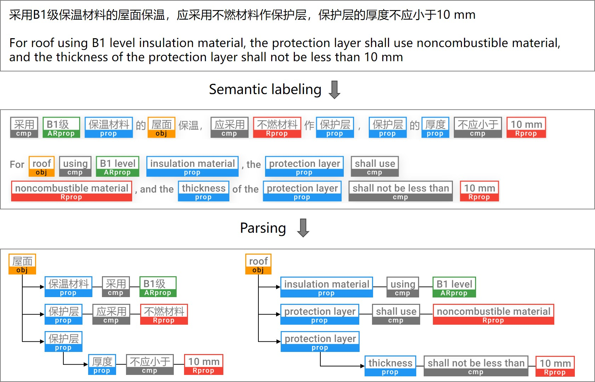

# Auto Rule Transform

Automated rule transformation for automated rule checking.  

This repo contains the dataset, codes, and documents for the paper entitled "Deep natural language processing-based rule transformation for automated regulatory compliance checking" (DOI: http://dx.doi.org/10.13140/RG.2.2.22993.45921).  




## Dataset Information

In data/xiaofang/[sentences_all.json](https://github.com/Zhou-Yucheng/auto-rule-transform/blob/main/data/xiaofang/sentences_all.json), it contains all sentences (in Chinese) with labels developed in this research.  

In src/logs/[rulecheck-eval.log](https://github.com/Zhou-Yucheng/auto-rule-transform/blob/main/src/logs/rulecheck-eval.log), it shows the parsing result of these sentences in a text-based format (note: if you are using VSCode, you can install the Log File Highlighter extension and configure it with the [log-file-highlighter.txt](src/logs/log-file-highlighter.txt) to enable our customized syntax highlight).

## Setup

- Clone or download the repo  
  ```
  git clone https://github.com/Zhou-Yucheng/auto-rule-transform.git
  cd auto-rule-transform
  ```
- Install the requirements


## Semantic labeling

This repo uses [Pytorch](https://pytorch.org/) for training deep learning models. You can follow the official [get-started](https://pytorch.org/get-started/locally/) to install it.

Note: if you want to use FP16 acceleration to train the model, please ensure your Pytorch version >= 1.6, because we use the Pytorch native module [torch.cuda.amp](https://pytorch.org/docs/stable/amp.html) which is introduced in Pytorch 1.6. Otherwise, you may would like to comment the `from torch.cuda.amp import autocast, GradScaler` and remove relevant statements in train.py.

Run train.py in src/, and then you will get the trained model in src/models/ and the log file in src/logs/train.log.

  ```
python3 train.py
  ```
For more information about usages, run `python3 train.py -h`  

To report the performance of a model in src/models/, rename it to _BertZh0_best.pth and run:

  ```
python3 train.py --report # it will report the model named _BertZh0_best.pth
  ```

## Parsing

Run ruleparse.py in src/, and then it will read the sentences in data/xiaofang/sentences_all.json and log the result in src/logs/ruleparse.log & src/logs/ruleparse-eval.log

  ```
python3 ruleparse.py -d json
  ```

If you want to change the dataset of parsing to data/xiaofang/sentences.txt, use the -d argument to specify:

  ```
python3 ruleparse.py -d text
  ```

To generate the [XML check set](https://interoperability.autodesk.com/modelcheckerconfigurator/downloads/xmlschema.pdf) rules for [Autodesk Revit model checker](https://interoperability.autodesk.com/modelchecker.php) after the parsing, add -g switch (in beta version now):

  ```
python3 ruleparse.py -d text -g
  ```

If you want to perform interactive rule transformation, run:

  ```
python3 ruleparse.py -i
# then, input the id of a sentence (see data/xiaofang/sentence_all.json),  
# it will read the sentence and show the parsing result immediately
  ```

## License
This project is free and open source for universities, research institutes, enterprises and individuals for research purposes only, and the commercial purpose is not permitted.  
本项目面向大学、研究所、企业以及个人用于研究目的免费开放源代码，不得将其用于任何商业目的。

